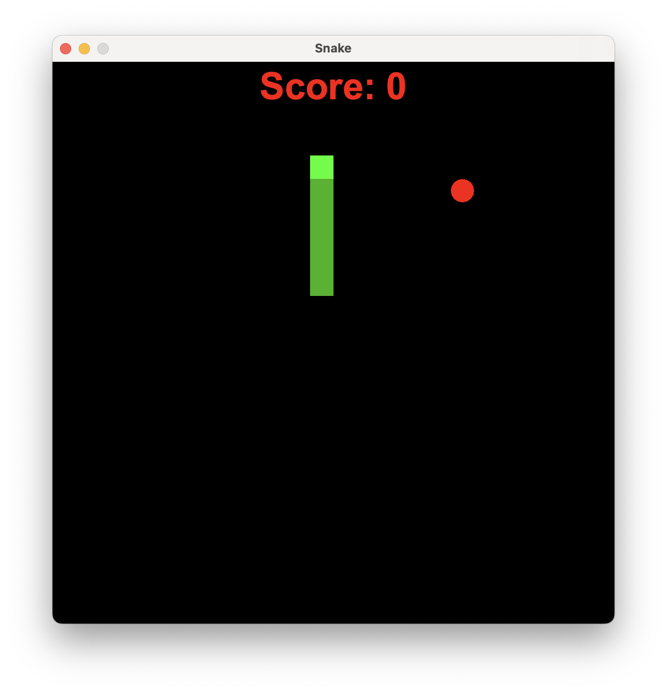
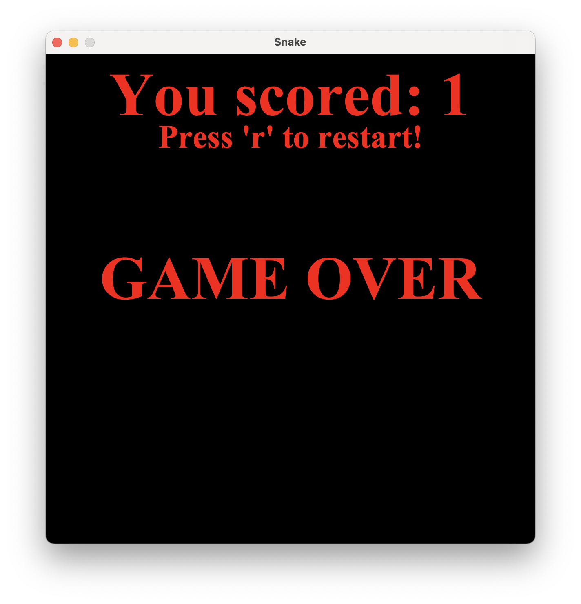

# Snake Game

This is a simple implementation of the classic Snake game to practice Java. You control your direction with the arrow keys, and can restart at any time by pressing the 'R' key.

## Installation

- Download the latest version of Java
- Clone the repository to your machine
- Run the program!

## Pictures

